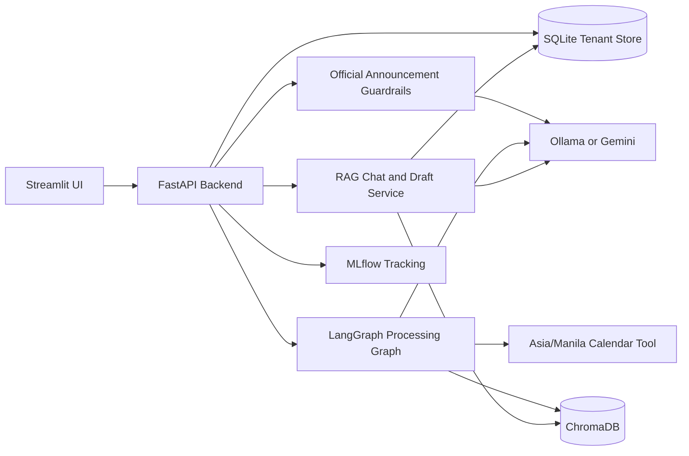

# SwiftMemo

SwiftMemo is an agentic AI triage MVP for university Help Desk Announcements at De La Salle University. It turns raw HDA-style emails into structured summaries, rejects non-institutional messages with guardrails, answers tenant-private archive questions, and evaluates rubric metrics with MLflow.

The Midterm MVP uses a required `X-User-ID` header as tenant identity. This is not production authentication; it is the isolation boundary for persisted emails, summaries, preferences, chat memory, feedback, and Chroma metadata.

## Setup

Local development defaults to Ollama. The recommended local setup for this project is `gemma4:12b` for chat/extraction and `nomic-embed-text:latest` for Chroma embeddings.

```bash
ollama list
docker-compose up --build
```

Open:

- Streamlit UI: http://localhost:8501
- FastAPI docs: http://localhost:8000/docs
- MLflow: http://localhost:5001

For Gemini mode, create `.env`:

```bash
LLM_PROVIDER=gemini
GOOGLE_API_KEY=your_gemini_api_key
GEMINI_MODEL=gemini-1.5-flash
```

For an Ollama server running on another machine, use `OLLAMA_BASE_URL`:

```bash
LLM_PROVIDER=ollama
OLLAMA_MODEL=gemma4:12b
OLLAMA_BASE_URL=http://your-ollama-server:11434
EMBEDDING_PROVIDER=ollama
OLLAMA_EMBEDDING_MODEL=nomic-embed-text:latest
```

Check server reachability:

```bash
curl http://your-ollama-server:11434/api/tags
```

## Architecture



SQLite persists to `data/swiftmemo.db` locally and `/app/data/swiftmemo.db` in Docker. Chroma collection names include the embedding provider/model so a 384-dimensional old index cannot be queried with 768-dimensional `nomic-embed-text` vectors.

## API Contract

All private endpoints require:

```text
X-User-ID: andrei
```

Endpoints:

- `GET /health` checks service status.
- `POST /api/ingest` ingests one email or mock HDAs for the tenant.
- `POST /api/process` runs guardrails, LangGraph extraction, preference routing, persistence, and vector indexing.
- `GET /api/summaries?visible_only=true` returns structured summaries scoped to the tenant.
- `POST /api/chat` answers from Chroma with `where={"user_id": ...}` and SQLite chat memory by `(user_id, session_id)`.
- `GET /api/preferences` and `PUT /api/preferences` manage category toggles. `events` defaults off; `academic` defaults on.
- `POST /api/draft` creates a professional contextual reply draft from tenant-filtered retrieval.
- `POST /api/feedback` records Phase 2 classification override data.
- `GET /api/summary/audio/{summary_id}` returns a placeholder WAV audio response for Phase 2.
- `WebSocket /ws/notifications/{user_id}` exposes the Phase 2 notification stub.

Example:

```bash
curl -H "X-User-ID: andrei" http://localhost:8000/api/summaries
```

Manual chat test:

```bash
curl -s -X POST http://localhost:8000/api/chat \
  -H "Content-Type: application/json" \
  -H "X-User-ID: andrei" \
  -d '{"message":"when do i have to enroll?","session_id":"manual-test","top_k":4}'
```

Expected answer from the fixture: enrollment runs from July 10 to July 15, 2026, with confirmation due by 11:59 PM on July 15, 2026.

## Evaluation

Run the deterministic rubric benchmark:

```bash
python evaluate.py
```

It prints JSON and logs to MLflow when tracking is reachable:

- guardrail precision
- guardrail recall
- Pydantic schema validation success rate
- Asia/Manila relative-date extraction accuracy

## Development Notes

- Mock announcements live in `data/mock_hdas.json`.
- Real received emails should be sanitized into fixture JSON instead of connecting Gmail directly for this Midterm MVP.
- The current fixture has 8 valid announcements and 3 rejected records. `real-hda-2026-001` is a valid OVPERI exchange announcement; `hda-2026-008` is rejected because Canvas/Instructure grade notifications are LMS activity notices, not institutional HDAs.
- `backend/database.py` is the SQLite source of truth for tenant-scoped records.
- `backend/agents.py` contains the LangGraph flow: validation, structured extraction, preferences, vector indexing, and draft helper.
- `backend/rag.py` stores mandatory vector metadata: `user_id`, `email_id`, `subject`, `date`, `sender`, `category`, and `visible_in_feed`.
- If the configured LLM or embedding service is unavailable, deterministic fallback paths keep tests and demos usable.
- The ingestion helper accepts a tenant header:

```bash
python scripts/ingest_mock_data.py --api http://localhost:8000 --user-id andrei
```

To load and process the full mock fixture from the API:

```bash
curl -s -X POST http://localhost:8000/api/ingest \
  -H "Content-Type: application/json" \
  -H "X-User-ID: andrei" \
  -d '{"load_mock": true}'

curl -s -X POST http://localhost:8000/api/process \
  -H "Content-Type: application/json" \
  -H "X-User-ID: andrei" \
  -d '{"limit": 25}'
```

## Verification

```bash
pytest
python evaluate.py
docker-compose config
docker-compose up --build
```

## Module Ownership

| Team Member | Modules |
| --- | --- |
| Andrei | ReAct loops, tools, RAG isolation, memory |
| Audric | Pydantic outputs, guardrails, draft engine |
| Sophia | FastAPI, Docker, MLflow, evaluation |
