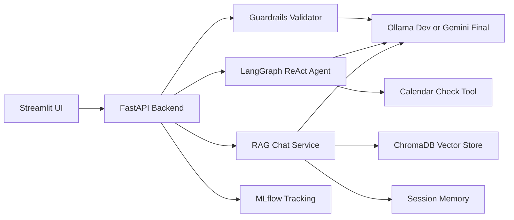

# SwiftMemo

SwiftMemo is an agentic AI triage MVP for university Help Desk Announcements at De La Salle University. It turns raw HDA-style emails into structured summaries, rejects non-institutional messages with guardrails, and answers policy questions from historical announcement context.

The business case is announcement fatigue: critical deadlines, access procedures, and policy updates are often buried in inboxes. SwiftMemo demonstrates how a backend AI service can reduce missed action items while giving teams measurable observability through MLflow.

## Setup

Local development defaults to Ollama so Gemini usage can be saved for the final demo.

```bash
ollama list
docker-compose up --build
```

Open:

- Streamlit UI: http://localhost:8501
- FastAPI docs: http://localhost:8000/docs
- MLflow: http://localhost:5001

For final Gemini mode, create a `.env` file:

```bash
LLM_PROVIDER=gemini
GOOGLE_API_KEY=your_gemini_api_key
GEMINI_MODEL=gemini-1.5-flash
```

Then run:

```bash
docker-compose up --build
```

## Architecture



## API

- `GET /health` checks service status and active LLM provider.
- `POST /api/ingest` validates one email or the mock dataset with guardrails.
- `POST /api/process` runs guardrails plus LangGraph ReAct extraction and returns strict JSON.
- `POST /api/chat` answers policy questions from ChromaDB context with conversational memory.

## Module Ownership

| Team Member | Modules |
| --- | --- |
| Andrei | ReAct Agent, Tool Use, RAG, Memory |
| Audric | Structured Outputs, Guardrails |
| Sophia | LLMOps, API Endpoint / Dockerization |

## Development Notes

- Mock announcements live in `data/mock_hdas.json`.
- The RAG index excludes the guardrail-negative mock records so policy answers retrieve official-looking institutional context only.
- The ingestion helper can load records through the API:

```bash
python scripts/ingest_mock_data.py --api http://localhost:8000
```

- Local default models are `qwen2.5:latest` for chat and `all-minilm:latest` for free local embeddings through Ollama.
- `EMBEDDING_PROVIDER=huggingface` is supported in code, but requires installing `sentence-transformers`; the Docker MVP keeps this optional dependency out to avoid pulling the full Torch stack.
- MLflow logs latency, provider/model parameters, prompt/response artifacts, trace metadata, and best-effort token usage for guardrails, agent processing, retrieval, and RAG chat.
